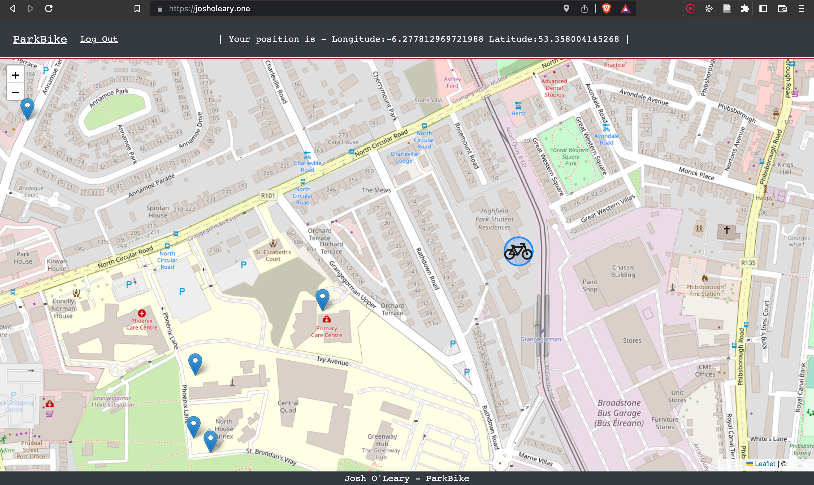
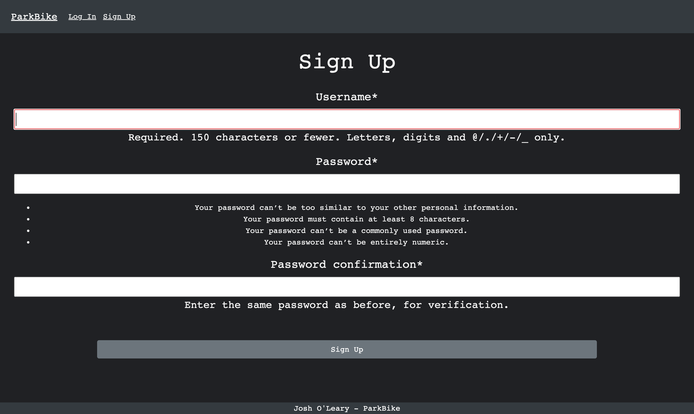
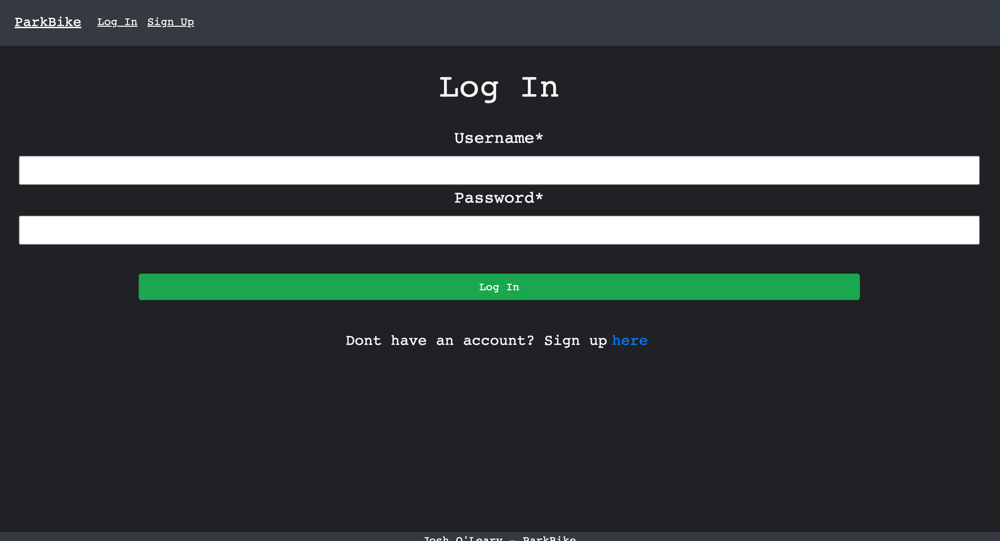
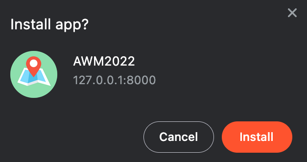
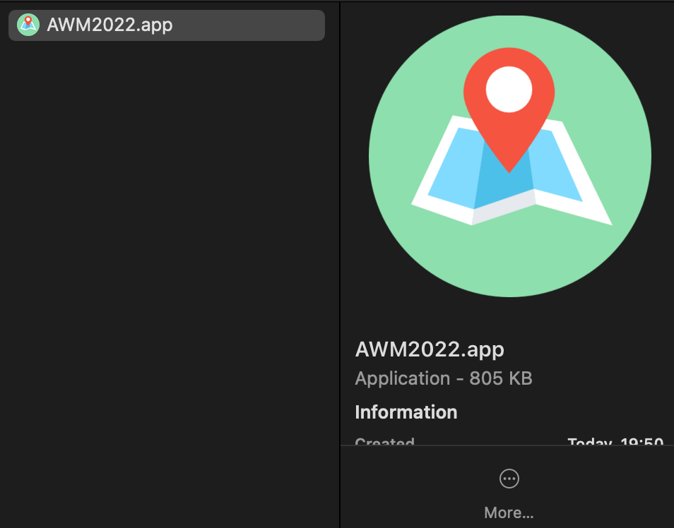
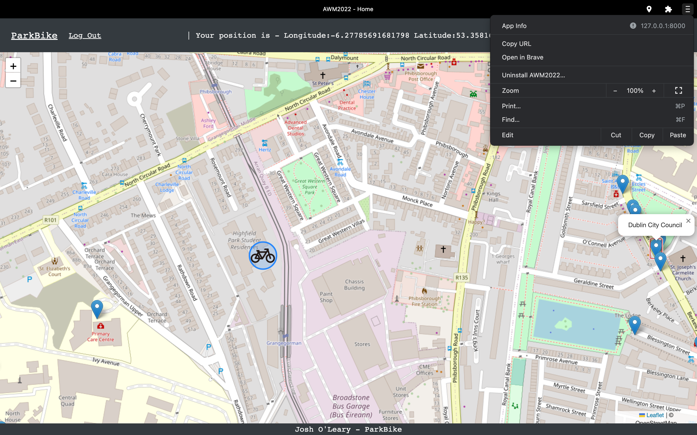
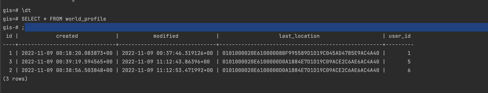

# Advanced Web Mapping CA2

## BikePark
This web application allows users to set up an account and login in order to locate their current position on the map. It then finds nearby places to park your bike so you have places to end your journey while travelling throughout Ireland. It saves your last location to the database so you can see where your bike was last parked. This web application is a progressive web app so it can be installed from the browser and added to the home screen.

GitHub link: https://github.com/Josholeary/AdvWebMap

Deployment Link: https://josholeary.one/

## Technologies:
- Django
- Leaflet JS
- PostgreSQL
- Docker
- Django-PWA
- Overpass API

## Screenshots:

- Deployed Web Application

- Location and Bikes Parking Page

- Arrival Page

- Signup Page

- Login Page

- PWA Install Prompt

- PWA File

- PWA MAP

- Database Updating

